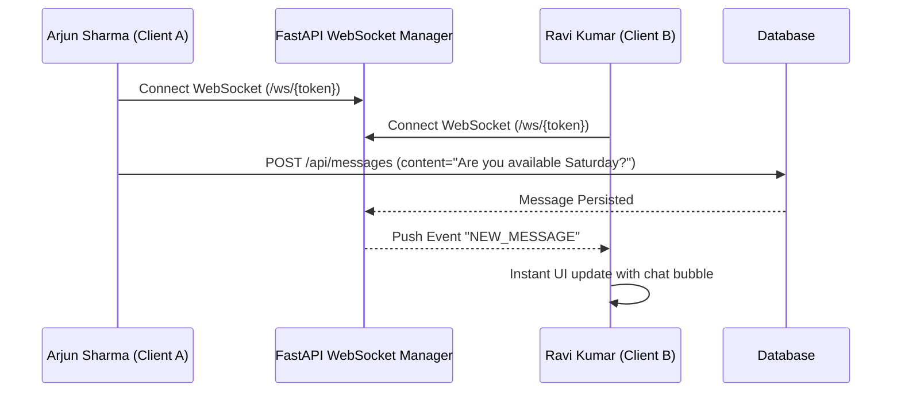

# SkillBarter System Architecture

SkillBarter is a production-quality full-stack hyperlocal platform built around a non-negotiable **zero-cash barter model** governed by an algorithmic community trust score.

---

## 1. High-Level Architecture Diagram

```
┌─────────────────────────────────────────────────────────────┐
│                       Client Layer                          │
│  React 19 + TypeScript + Vite + Tailwind CSS + Lucide React │
│  - Single Page Application with React Router                │
│  - Responsive Mobile Bottom Navigation                      │
│  - Quick 1-Click Demo Persona Switcher                      │
└───────────────────────────┬───▲─────────────────────────────┘
                            │   │
                  REST APIs │   │ WebSockets (/ws/{token})
                            │   │
┌───────────────────────────▼───┴─────────────────────────────┐
│                      FastAPI Backend                        │
│  - Token-based Authentication (JWT, native bcrypt)          │
│  - Geospatial Privacy & Distance Obfuscation Layer          │
│  - Reciprocal Skill Matching Engine                         │
│  - Mutual-Completion Barter State Machine                   │
│  - Dynamic Community Trust Engine                           │
│  - Real-Time WebSocket Connection Multiplexer               │
└───────────────────────────┬─────────────────────────────────┘
                            │
              SQLAlchemy 2.0 ORM & Spatial Queries
                            │
┌───────────────────────────▼─────────────────────────────────┐
│                     Data Persistence                        │
│  - PostgreSQL 16 + PostGIS (Production / Docker)            │
│  - SQLite with Native Haversine Fallback (Local / Tests)     │
│  - Tables: users, skills, user_skills, exchanges, reviews,  │
│            messages, notifications, connections, posts,     │
│            reports, blocks                                  │
└─────────────────────────────────────────────────────────────┘
```

---

## 2. Core Architectural Pillars

### A. Zero Cash Invariant
There are no payment gateway integrations, currencies, coins, tokens, or prices in the codebase. All transactions are purely skill-for-skill trades.

### B. Hyperlocal Privacy Protection
Exact user GPS coordinates and home addresses are never exposed over public APIs. Distance is computed server-side and presented as an approximate relative metric (e.g. `"1.8 km away"`, `"Within 2 km"`).

### C. Mutual Completion Protocol
To prevent unilateral claims of completion:
- Requester marks completed -> `requester_completed = True`
- Receiver marks completed -> `receiver_completed = True`
- Status transitions to `COMPLETED` only when **both** parties confirm delivery.

### D. Dual Database Compatibility
The database abstraction seamlessly supports:
1. **PostgreSQL + PostGIS** for indexed spatial queries in cloud/Docker deployments.
2. **SQLite + Haversine geospatial engine** for instant zero-dependency local development and automated CI testing.

---

## 3. Real-Time Communication Pipeline


